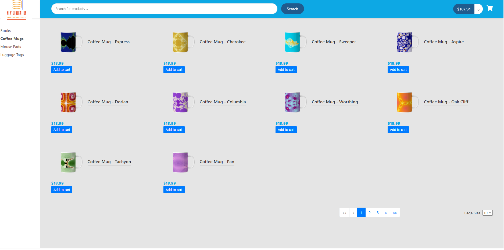
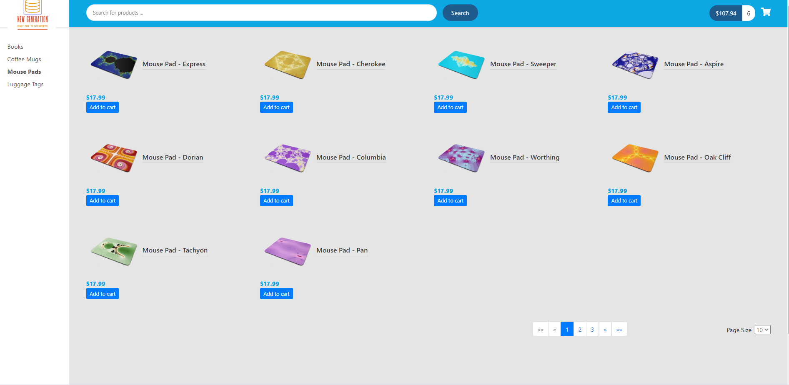
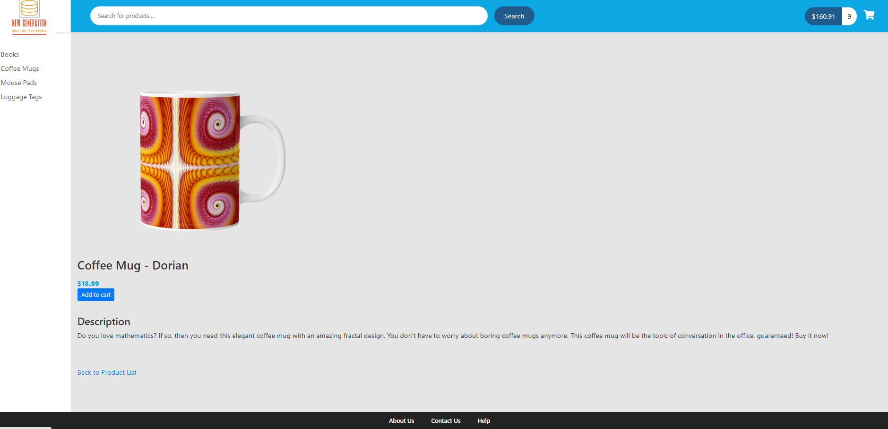
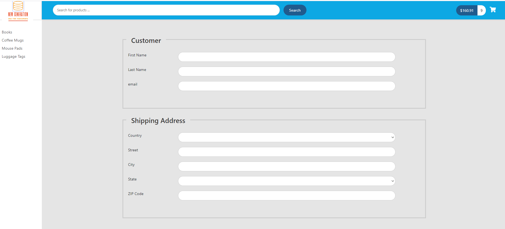
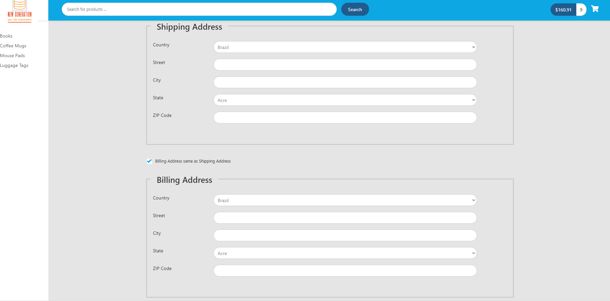
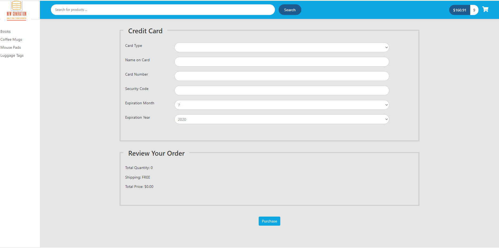

# ecommerce-project-Angular-SpringBoot

**Spring Boot
*Developed a Full stack project with Angular and Spring Boot.
*Leveraged the Hibernate API to develop a CRUD app with MySQL.
*Developed REST APIs with Spring Data REST.
*Developed custom queries using the Spring Data JPA.   
*Accelerated the development process with Spring Data REST.
*Applied pagination and sorting to REST API endpoints.
*Configured default page sizes for REST APIs.

**Angular
*Created new Angular projects using Angular CLI tool.
*Developed custom Angular components and services.
*Injected Angular services into custom Angular services.
*Performed REST client calls between Angular and Spring Boot.
*Defined Angular routes to perform navigation between Angular components.
*Added custom searching for data in Angular application.
*Applied Angular pagination to display views of REST API data.
*Developed Angular components to populate drop-down lists.

